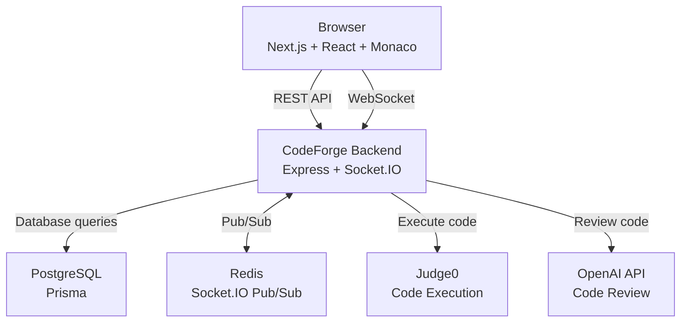

# CodeForge

A real-time collaborative coding platform — create a room, write code together live, chat, run code, and get AI-powered code review, all in the browser.

> **Status:** Core platform functionality implemented. UI/UX polish and production deployment are next.

## Features

* 🔐 **Authentication** — email/password registration and login with JWT sessions stored in httpOnly cookies
* 🧩 **Collaborative rooms** — create rooms or join using a shareable join code
* ⚡ **Real-time code editor** — Monaco Editor with live code synchronization over Socket.IO
* 👥 **Presence** — see which users are currently active in a room
* 💬 **Live chat** — persistent room chat with real-time message delivery
* ▶️ **Code execution** — execute supported languages through Judge0 and view stdout, stderr, and compilation output
* ✦ **AI code review** — OpenAI-powered code analysis with structured severity-based feedback
* 🧪 **Automated testing** — backend Jest/Supertest tests and frontend Jest/React Testing Library tests
* 📈 **Horizontal scaling ready** — Redis adapter enables Socket.IO events to propagate across multiple backend instances

## Tech Stack

### Frontend

* Next.js
* React
* TypeScript
* Tailwind CSS
* Monaco Editor
* Socket.IO Client
* Jest
* React Testing Library

### Backend

* Node.js
* Express
* TypeScript
* Socket.IO
* Prisma
* PostgreSQL
* Redis
* JWT
* Jest
* Supertest

### Infrastructure

* Docker Compose
* PostgreSQL
* Redis

### External Services

* Judge0 — code execution
* OpenAI API — AI code review

## Architecture



### Real-Time Collaboration

CodeForge uses Socket.IO for real-time room communication.

```text
User A
   │
   │ code:change
   ▼
Backend Instance 1
   │
   │ Redis Pub/Sub
   ▼
Backend Instance 2
   │
   │ code:update
   ▼
User B
```

The Redis Socket.IO adapter allows multiple backend instances to share Socket.IO events instead of relying only on the in-memory adapter of a single process.

## How CodeForge Works

### 1. Authentication

Users register or log in through the REST API.

The backend:

1. Validates the request.
2. Hashes passwords using bcrypt.
3. Creates a JWT.
4. Stores the JWT in an httpOnly cookie.
5. Uses authentication middleware to protect private resources.

### 2. Collaborative Rooms

A user can create a room or join an existing room using its join code.

Room membership is stored in PostgreSQL through Prisma.

Each room maintains information such as:

* Room name
* Join code
* Programming language
* Current code
* Owner
* Members
* Chat messages

### 3. Live Code Synchronization

When a user changes the editor:

```text
Monaco Editor
     ↓
300ms debounce
     ↓
code:change
     ↓
Socket.IO server
     ↓
Other room members
     ↓
code:update
```

The frontend also prevents remote updates from being emitted back to the server, avoiding a code synchronization feedback loop.

### 4. Presence

Socket.IO events track users entering and leaving rooms.

The frontend maintains the current list of users present in the room and prevents duplicate presence entries.

### 5. Chat

Chat messages are persisted in PostgreSQL and delivered to connected room members through Socket.IO.

This provides both:

* historical messages when entering a room
* real-time messages while connected

### 6. Code Execution

Code is sent from the backend to Judge0 for execution.

The execution result can contain:

* Standard output
* Standard error
* Compilation output
* Execution status

The result is then returned to the frontend.

### 7. AI Code Review

The backend sends the selected language and code to the OpenAI API.

The review service requests structured JSON containing:

* Overall summary
* Issue severity
* Relevant line number
* Actionable message

The backend validates the response before returning it to the client.

## Redis Scaling

CodeForge includes the Socket.IO Redis adapter.

Without Redis:

```text
Client → Backend Instance
```

With multiple backend instances:

```text
                    ┌── Backend 1 ── Client A
                    │
Client events ──────┤
                    │
                    └── Backend 2 ── Client B
                           │
                         Redis
```

Redis allows Socket.IO events received by one backend instance to be propagated to other instances.

This makes the real-time layer suitable for horizontal scaling.

> Redis does not automatically make every piece of application state distributed. Application-level in-memory state and deployment concerns such as load-balancer/session configuration may still require additional work.

## Project Structure

```text
CodeForge/
├── backend/
│   ├── prisma/
│   └── src/
│       ├── config/
│       ├── controllers/
│       ├── middleware/
│       ├── routes/
│       ├── services/
│       ├── sockets/
│       ├── testUtils/
│       └── server.ts
│
├── frontend/
│   ├── components/
│   ├── context/
│   ├── hooks/
│   ├── lib/
│   ├── testUtils/
│   └── app/
│
├── docker-compose.yml
└── README.md
```

## Getting Started

### Prerequisites

Make sure you have:

* Node.js
* npm
* Docker Desktop
* PostgreSQL/Redis through Docker Compose
* Judge0 credentials
* OpenAI API credentials

### 1. Clone the repository

```bash
git clone https://github.com/vanshika8604/CodeForge.git
cd CodeForge
```

### 2. Start infrastructure

Make sure Docker Desktop is running, then:

```bash
docker compose up -d
```

This starts the CodeForge PostgreSQL and Redis services.

### 3. Configure the backend

Create:

```text
backend/.env
```

using the variables documented below.

Then:

```bash
cd backend
npm install
npx prisma generate
npx prisma migrate dev
npm run dev
```

The backend runs on:

```text
http://localhost:4000
```

### 4. Start the frontend

In another terminal:

```bash
cd frontend
npm install
npm run dev
```

The frontend runs on:

```text
http://localhost:3000
```

## Environment Variables

Never commit real secrets.

Example backend configuration:

```env
PORT=4000
NODE_ENV=development

DATABASE_URL=
TEST_DATABASE_URL=

JWT_SECRET=

OPENAI_API_KEY=
OPENAI_MODEL=gpt-4o-mini

JUDGE0_API_URL=
JUDGE0_API_KEY=

FRONTEND_URL=http://localhost:3000

REDIS_URL=redis://localhost:6379
```

Frontend configuration:

```env
NEXT_PUBLIC_API_URL=http://localhost:4000
NEXT_PUBLIC_SOCKET_URL=http://localhost:4000
```

Use the actual variable names from the project's `.env.example` files when configuring a local environment.

## Docker Services

The project's Docker Compose configuration provides:

| Service    | Purpose              |   Port |
| ---------- | -------------------- | -----: |
| PostgreSQL | Application database | `5432` |
| Redis      | Socket.IO Pub/Sub    | `6379` |

Judge0 may be run separately depending on the local development configuration.

## Testing

### Backend

```bash
cd backend
npm run test:ci
```

Backend tests cover areas including:

* Authentication services
* Room services
* Chat services
* OpenAI service behavior
* Judge0 service behavior
* Authentication routes
* Room routes
* Chat routes
* Session routes
* Socket-related behavior

### Frontend

```bash
cd frontend
npm test
```

Frontend tests cover:

* Authentication form behavior
* Room creation
* Presence rendering
* Code execution UI
* Socket connection behavior
* Room presence and chat events
* Monaco editor code synchronization
* Debounced code changes
* Remote update feedback-loop prevention

## Production Deployment

Production deployment is **not yet completed**.

Before deployment, the project should be configured with:

* Production PostgreSQL
* Production Redis
* Secure environment variables
* Production frontend URL
* Production backend URL
* HTTPS
* Appropriate CORS configuration
* Production Judge0 configuration
* OpenAI API credentials
* Load balancing for multiple backend instances if required
* Appropriate Socket.IO deployment configuration

## Current Status

### Completed

* [x] Backend architecture
* [x] PostgreSQL + Prisma
* [x] Authentication
* [x] Protected API routes
* [x] Room creation and joining
* [x] Room membership and authorization
* [x] Real-time collaboration
* [x] Monaco Editor integration
* [x] Presence tracking
* [x] Live chat
* [x] Judge0 code execution
* [x] OpenAI code review
* [x] Redis Socket.IO adapter
* [x] Docker Compose infrastructure
* [x] Backend automated tests
* [x] Frontend automated tests
* [x] Socket/useRoomSocket tests
* [x] CodeEditor socket synchronization tests

### Remaining

* [ ] UI/UX polish
* [ ] Production deployment
* [ ] Production configuration verification
* [ ] Demo screenshots/GIF
* [ ] CI/CD pipeline

## Known Limitations

* Redis currently handles Socket.IO Pub/Sub, but it does not automatically distribute every piece of application-level in-memory state.
* Production deployment requires appropriate load-balancer and Socket.IO configuration.
* Judge0 and OpenAI require valid external service credentials.
* The current interface is functional but still requires a dedicated UI/UX polish pass before the final demo.

## Roadmap

* [x] Backend setup
* [x] Authentication
* [x] Room management
* [x] Real-time collaboration
* [x] Live chat and presence
* [x] Monaco Editor
* [x] Code execution
* [x] AI code review
* [x] Redis Socket.IO scaling
* [x] Backend testing
* [x] Frontend testing
* [ ] UI/UX redesign and visual polish
* [ ] Production deployment
* [ ] Demo screenshots/GIF
* [ ] CI/CD

## License

This project is licensed under the MIT License.
